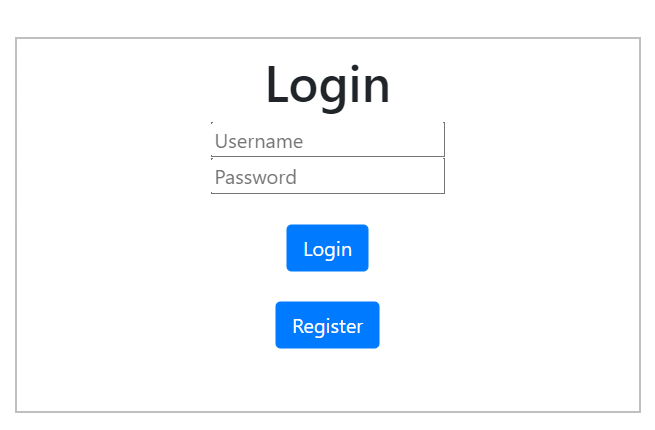
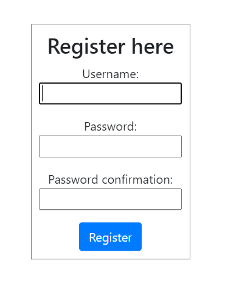

# Bulletin Board App

## Table of Contents
- [Description](#description)
- [Intallation](#installation)
- [Usage](#usage)
- [Credits](#credits)

## Description
This project is a Django web application designed for users to interact with posts on a bulletin board. The application contains features that allow the user to send, edit/update, and delete posts for other users to see and interact with.

This application will run on Python, using the Django framework to host the web application. The webpages are designed with HTML & CSS (along with some Bootstrap)

## Installation

### Windows
To install this project on your computer, please follow these steps in order:
1. Create a directory (folder) where you wish to install the project. You can go to your terminal and create the directory as follows:
    ```shell
    mkdir "Bulletin_Board"
    ```

2. Open your terminal/command prompt and navigate to the selected directory:
   ```shell
    cd "Bulletin_Board"
    ```
   
3. Create a virtual environment in the directory:
    ```shell
    python3 -m venv venv
    ```
   OR
   ```shell
    python -m venv venv
   ```

4. Activate the virtual environment you created:
    ```shell
    venv\Scripts\activate
    ```
   OR manually navigate to the Scripts directory and activate the virtual environment:
   ```shell
   cd venv
   cd Scripts
   activate 
   ```

5. Install the required packages from requirements.txt
    ```shell
    pip install -r requirements.txt
    ```
   
6. Run the manage.py file:
    ```shell
    python manage.py runserver
    ```
   
### Docker
To install this project on docker, open your terminal and run these commands in order:
1. Pull the Docker image:
   ```shell
    docker pull ccread/capatone_project:posts 
    ```
   
2. Run the Docker image:
    ```shell
    docker run --name capatone_project -p 8000:8000 -d ccread/capatone_project:posts 
    ```
    You should see a long output of characters containing letters and numbers.


3. Click on the following link to access the web application: http://localhost:8000/

To stop the application, you need to find the container ID of the docker image running. To get this container ID, enter this command:
```shell
docker ps
```

You should see this output on the terminal:
```
CONTAINER ID   IMAGE                           COMMAND                  CREATED         STATUS         PORTS                    NAMES
xxxxxxxx   ccread/capatone_project:posts   "python manage.py ru…"   7 seconds ago   Up 6 seconds   0.0.0.0:8000->8000/tcp   capatone_project
```

Copy the container ID, then enter this command 'docker stop', followed by the container ID you just copied:
```shell
docker stop xxxxxx
```
The terminal should output the same  container ID you copied, showing that the project has closed successfully.

## Usage
NOTE: New users will be required to register their details, and then login before accessing the rest of the web application!

Login:

   

Registration:

   

You will be greeted with a welcome message and a link to the Bulletin Board app where you'll be able to post, update, or delete content.

## Credits
Shingai Dzinotyiweyi [GitHub Profile](https://github.com/C-CREAD)

[Repository Link](https://github.com/C-CREAD/Bulletin_Board) 
